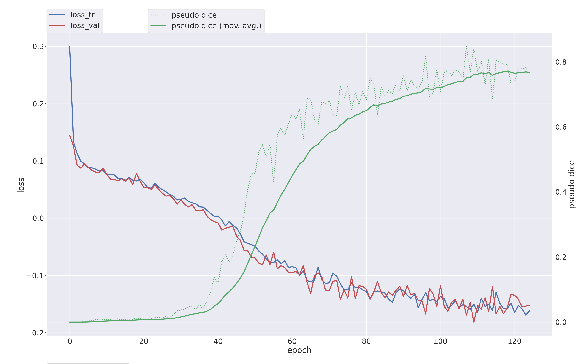

---

## 🦴 Overview

*Welcome to the Spine Segmentation project using **nnU-Net v2***  

This repository presents a **multi-class vertebrae segmentation project**
trained on volumetric **CT scans** using **nnU-Net v2**, a state-of-the-art
self-configuring framework for medical image segmentation.

The project is designed to serve both:
- **Research purposes** (clear metrics, configuration, evaluation)
- **Professional portfolio presentation** (visual results, clarity, reproducibility)

---

## 🎯 Task Description

- **Problem**: Automatic segmentation of individual vertebrae  
- **Input**: 3D CT volumes (`.nii.gz`)  
- **Output**: Multi-class vertebrae masks  
- **Classes**: 25 anatomical labels  
- **Approach**: Fully automatic nnU-Net v2 pipeline  

---

## 🗂️ Dataset

- **Source**: Kaggle – Spine Segmentation from CT Scans  
- **Total scans**: 1089 CT volumes  
- **Format**: NIfTI (`.nii.gz`)  
- **Labels**: Multi-class vertebrae annotations  

🔗 Dataset link:  
https://www.kaggle.com/datasets/pycadmk/spine-segmentation-from-ct-scans

---

## 🧠 Model & Framework

This project uses **nnU-Net v2**, which automatically configures:

- Network architecture  
- Patch size & resolution  
- Normalization strategy  
- Loss functions  
- Training schedule  

No manual architecture tuning was performed.

---

## 🏷️ Vertebrae Labels

The segmentation includes the following anatomical structures:

- **Cervical**: C1 – C7  
- **Thoracic**: T1 – T12  
- **Lumbar**: L1 – L5  
- **Sacral**: S1  

**Total classes**: 25 (excluding background)

---

## 🦴 Segmentation Demo

  

---

## 📈 Training Progress

  

---

## 📊 Training Summary

| Item | Value |
|----|----|
| Framework | nnU-Net v2 |
| Modality | CT |
| Total classes | 25 |
| Training cases | 696 |
| Validation cases | 175 |
| Training epochs | **125** |
| Foreground Dice | ~0.70 |

---
- Dataset size: 1089 CT scans (raw Kaggle dataset)
- Cases used by nnU-Net after preprocessing: 871
- Training cases: 696
- Validation cases: 175
- Effective training epochs: 125

## ⚠️ Limitations

- Reduced performance on small or rare vertebrae  
- Class imbalance across anatomical regions  
- Intended for **research and decision-support**, not direct clinical use  

---

---

## 📚 Citation

If you use this project or nnU-Net in your research, please cite:

Isensee, F., Jaeger, P. F., Kohl, S. A., Petersen, J., & Maier-Hein, K. H. (2021).
nnU-Net: a self-configuring method for deep learning-based biomedical image segmentation.
Nature Methods, 18(2), 203–211.

---

## 👤 Author

**Waseem Almazrua**  
Medical Imaging & AI  

